# 🚀 Production-Grade DevOps Pipeline — Docker → Kubernetes → CI/CD → Prometheus → Grafana Monitoring


> **End-to-end production-grade DevOps pipeline** — Docker Containerization → GitHub Actions CI/CD → Kubernetes Deployment → Prometheus Metrics → Grafana Dashboards & Alerting

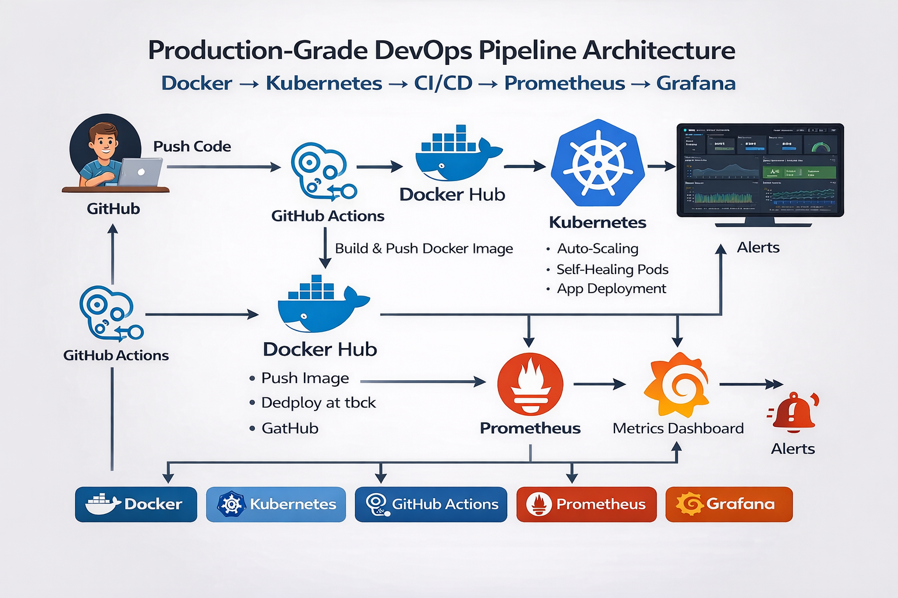

---

## 📌 Project Overview

This project demonstrates a **complete real-world DevOps monitoring pipeline** built from scratch — including containerizing a Python Flask application, automating builds and deployments via GitHub Actions, orchestrating workloads on Kubernetes, and implementing full observability using the Prometheus + Grafana stack.

The project was built to simulate a **production DevOps environment** — including real troubleshooting, self-healing infrastructure, metrics collection, PromQL-based dashboards, and threshold-based alerting.

---

## 🛠️ Tech Stack

| Tool | Purpose |
|---|---|
| **Docker** | Application containerization |
| **Kubernetes (Minikube)** | Container orchestration, self-healing pods, auto-scaling |
| **GitHub Actions** | CI/CD pipeline — build, test, deploy automation |
| **Prometheus** | Metrics scraping and collection |
| **Grafana** | Dashboards, visualization and alerting |
| **Helm** | Kubernetes package manager for monitoring stack |
| **Python Flask** | Sample microservice application |

---

## ⚡ Quick Start

Clone the repository:

```bash
git clone https://github.com/ThePoojaDas/devops-kubernetes-cicd-project.git
cd devops-kubernetes-cicd-project
```

Start Kubernetes cluster:

```bash
minikube start
```

Deploy the application:

```bash
kubectl apply -f kubernetes/
```

Access the application:

```bash
minikube service devops-service
```

Install monitoring stack:

```bash
helm repo add prometheus-community https://prometheus-community.github.io/helm-charts
helm repo update
helm install monitoring prometheus-community/kube-prometheus-stack
```

Open Grafana:

```bash
kubectl port-forward svc/monitoring-grafana 3000:80
```

Then open: `http://localhost:3000`

---

## 🏗️ Architecture


```
Developer (Push Code)
        │
        ▼
 GitHub Repository
        │
        ▼
 GitHub Actions CI/CD Pipeline
   ├─ Checkout Code
   ├─ Build Docker Image
   └─ Run Container
        │
        ▼
 Docker Image (devops-k8s-project:latest)
        │
        ▼
 Kubernetes Deployment (Minikube)
   ├─ ReplicaSet with Self-Healing Pods
   └─ NodePort Service (devops-service)
        │
        ▼
 Prometheus
   └─ Scrapes container/pod/node metrics
        │
        ▼
 Grafana Dashboards + Alert Rules
   ├─ Pod CPU & Memory Usage
   ├─ Network Traffic (Rx/Tx)
   ├─ Running Pods & Restart Count
   └─ Threshold-based Alerting → Contact Point
```

---

## 📁 Project Structure

```
devops-kubernetes-cicd-project/
│
├── app/                            # Flask application source code
│
├── kubernetes/                     # Kubernetes manifests
│   ├── deployment.yaml             # Deployment with replicas and self-healing
│   └── service.yaml                # NodePort service to expose the app
│
├── grafana-dashboards/             # Exported Grafana dashboard
│   └── devops-app-monitoring.json
│
├── .github/
│   └── workflows/
│       └── cicd.yml                # GitHub Actions CI/CD pipeline
│
├── screenshots/                    # Project screenshots
├── architecture-diagram.png        # Architecture diagram
├── Dockerfile                      # Container image build instructions
└── README.md
```

---

## ⚙️ Complete Step-by-Step Implementation

> Every command used in this project — in exact order from start to finish.

---

### 1️⃣ Project Folder Setup

```bash
mkdir devops-k8s-project
cd devops-k8s-project
mkdir app docker kubernetes grafana-dashboards .github/workflows
```

---

### 2️⃣ Docker — Containerize the Application

Build the Docker image:

```bash
docker build -t devops-k8s-project ./docker
```
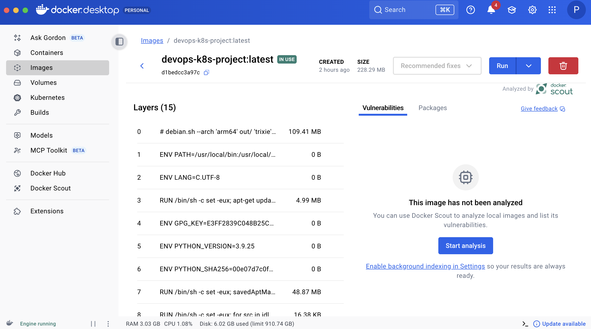

Verify the image was created:

```bash
docker images
```

Run the container locally to test:

```bash
docker run -d -p 5000:5000 devops-k8s-project
```
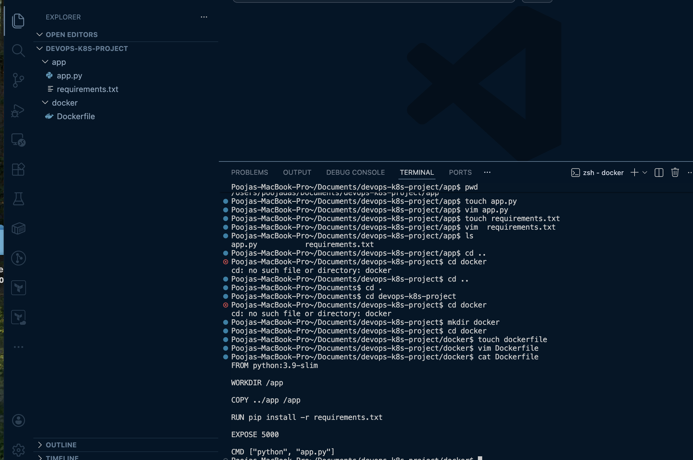

> ✅ App accessible at `http://localhost:5000`

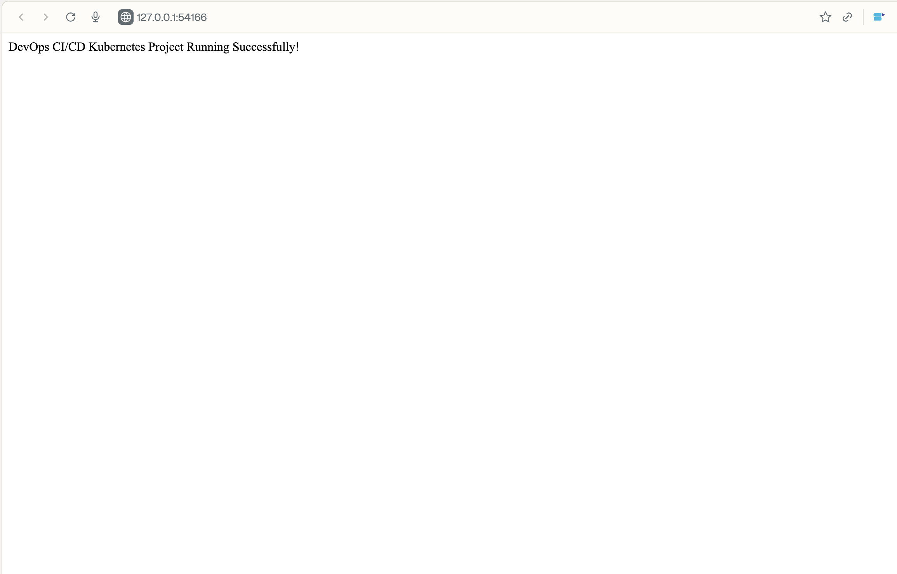

---

### 3️⃣ Start Kubernetes Cluster (Minikube)

```bash
minikube start
```

Verify the node is ready:

```bash
kubectl get nodes
```
---

### 4️⃣ Deploy Application to Kubernetes

Apply the deployment manifest:

```bash
kubectl apply -f deployment.yaml
```

Check pod status:

```bash
kubectl get pods
```

Load the local image into Minikube (required to fix ImagePullBackOff):

```bash
minikube image load devops-k8s-project:latest
```

Restart the deployment after loading image:

```bash
kubectl rollout restart deployment devops-app
```
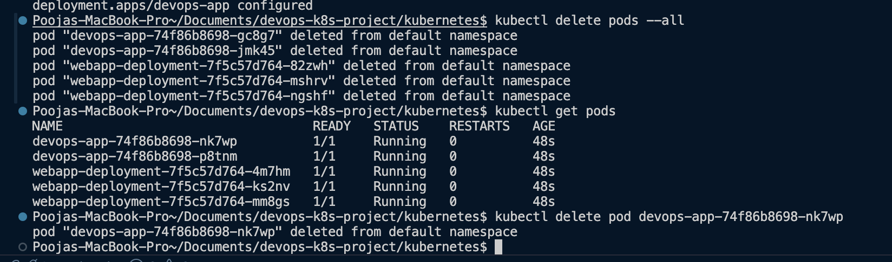

View pod logs:

```bash
kubectl logs <pod-name>
```

---

### 5️⃣ Expose the Application via Kubernetes Service

```bash
kubectl apply -f service.yaml
kubectl get svc
minikube service devops-service
```
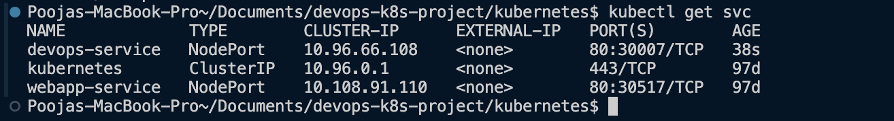

---

### 6️⃣ GitHub Repository Setup

```bash
git init
git add .
git commit -m "initial commit"
git push origin main
```
---

### 7️⃣ GitHub Actions CI/CD Pipeline

Pipeline file: `.github/workflows/cicd.yml`

Pipeline steps:
- Checkout code
- Build Docker image
- Run container

After fixing the Dockerfile path issue (see Troubleshooting), the pipeline ran end-to-end successfully.
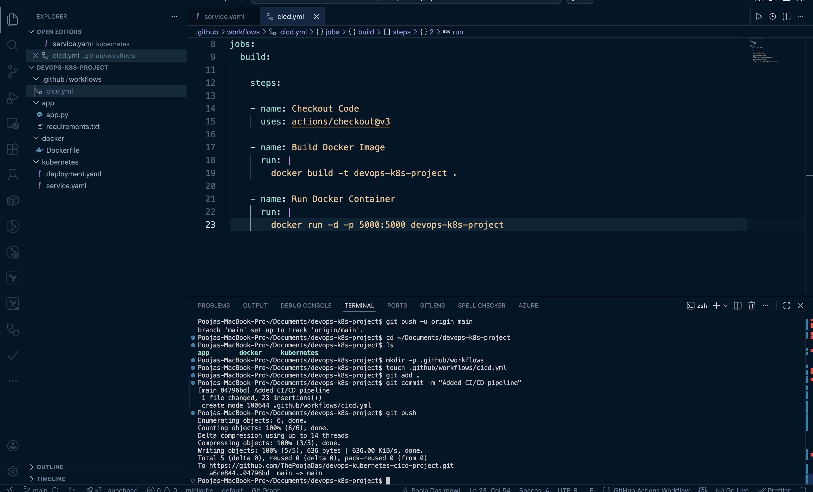
---

### 8️⃣ Install Prometheus + Grafana Monitoring Stack via Helm

```bash
helm repo add prometheus-community https://prometheus-community.github.io/helm-charts
helm repo update
helm install monitoring prometheus-community/kube-prometheus-stack
kubectl get pods
```

This installs: **Prometheus**, **Grafana**, **Alertmanager**, **Node Exporter**, **kube-state-metrics**

---

### 9️⃣ Access Grafana

Retrieve the admin password:

```bash
kubectl get secret monitoring-grafana -o jsonpath="{.data.admin-password}" | base64 --decode
```

Port-forward Grafana:

```bash
kubectl port-forward svc/monitoring-grafana 3000:80
```

Open: `http://localhost:3000`

---

### 🔟 Custom Grafana Dashboard — DevOps App Monitoring

| Panel | Metric |
|---|---|
| **Pod CPU Usage** | Real-time CPU per pod |
| **Pod Memory Usage** | Memory consumption over time |
| **Running Pods** | Count of active pods |
| **Pod Restart Count** | Detects crash loops |
| **Network Receive Traffic** | Inbound bytes per pod |
| **Network Transmit Traffic** | Outbound bytes per pod |
| **Cluster Nodes** | Node-level health |
| **Top CPU Consuming Pods** | Ranked CPU across all pods |

Example PromQL query used:

```promql
sum(rate(container_cpu_usage_seconds_total{namespace="default"}[5m])) by (pod)
```

---

### 1️⃣1️⃣ Simulate Traffic to Generate Metrics

```bash
while true; do curl http://127.0.0.1:57164; done
```
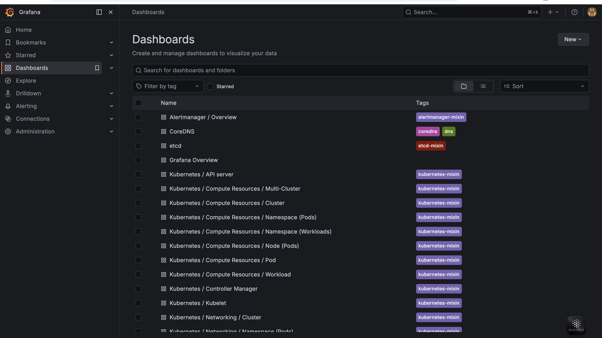
---

### 1️⃣2️⃣ Configure Grafana Alerting

```
WHEN  avg()  OF  cpu_usage  IS ABOVE  0.0001
```

| Alert State | Meaning |
|---|---|
| **Normal** | CPU below threshold |
| **Pending** | Threshold crossed, in evaluation window |
| **Firing** | Alert triggered — contact point notified |

Contact point: `devops-alert` (webhook)

---

### 1️⃣3️⃣ Export Dashboard & Push to GitHub

```bash
mv DevOps\ App\ Monitoring.-1773591756164.json grafana-dashboards/devops-app-monitoring.json
git add .
git commit -m "Added Grafana dashboard JSON"
git push
```

---

### 1️⃣4️⃣ Shut Down the Environment

```bash
minikube stop
minikube status
```

Expected output:

```
host: Stopped
kubelet: Stopped
apiserver: Stopped
```

---

## 🐛 Real Troubleshooting — Errors Faced & Fixed

> These are **actual errors** encountered and resolved during this project.

---

### ❌ Error 1 — Docker Build Failure: COPY path not found

```
COPY ../app /app not found
```

**Cause:** Dockerfile tried to copy a folder outside the Docker build context.

**Fix:** Corrected the Dockerfile location so `app/` was inside the build context:

```bash
docker build -t devops-k8s-project .
```

---

### ❌ Error 2 — Kubernetes: ImagePullBackOff

```
ErrImagePull
ImagePullBackOff
```

**Cause:** Kubernetes tried to pull the image from a remote registry. The image only existed locally.

**Fix:** Loaded the image directly into Minikube:

```bash
minikube image load devops-k8s-project:latest
kubectl rollout restart deployment devops-app
```

---

### ❌ Error 3 — kubectl apply: No Objects Passed

```
error: no objects passed to apply
```

**Cause:** Wrong filename used in the apply command.

**Fix:** Used the correct filename:

```bash
kubectl apply -f service.yaml
```

---

### ❌ Error 4 — GitHub Actions CI/CD Build Failure

**Cause:** Dockerfile was in `./docker` subfolder but the pipeline expected it at project root.

**Fix:** Moved Dockerfile to the root directory. Pipeline ran successfully after this.

---

### ❌ Error 5 — Grafana Alerts Not Triggering

**Cause:** Alert threshold was `0.05` but actual Prometheus CPU metric values were very small:

```
0.0002
0.001
```

**Fix:** Lowered the threshold:

```
0.05  →  0.0001
```

Alert state: **Normal → Pending → Firing** ✅

---

### ❌ Error 6 — Grafana Alert Contact Point Missing

**Cause:** Alert was firing but no notification delivered — contact point not configured.

**Fix:** Created webhook contact point `devops-alert` in Grafana → Alerting → Contact Points.

---

### ❌ Error 7 — Dashboard Export Filename Issue

**Cause:** Grafana auto-generated a long filename on export.

**Fix:**

```bash
mv DevOps\ App\ Monitoring.-1773591756164.json grafana-dashboards/devops-app-monitoring.json
```

---

## 📸 Project Screenshots

### Kubernetes Pods Running


### Kubernetes Service


### Application Running in Browser


### GitHub Actions Pipeline
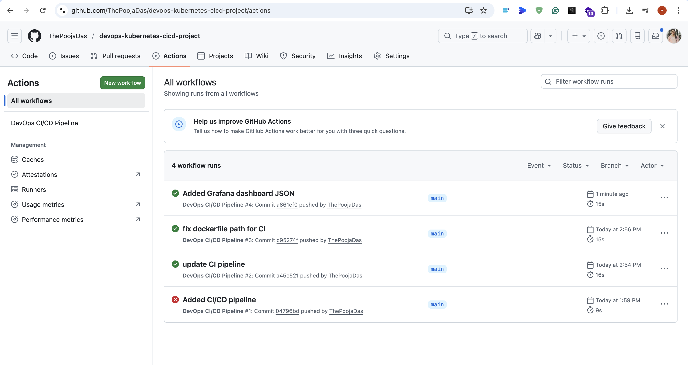

### Prometheus Targets
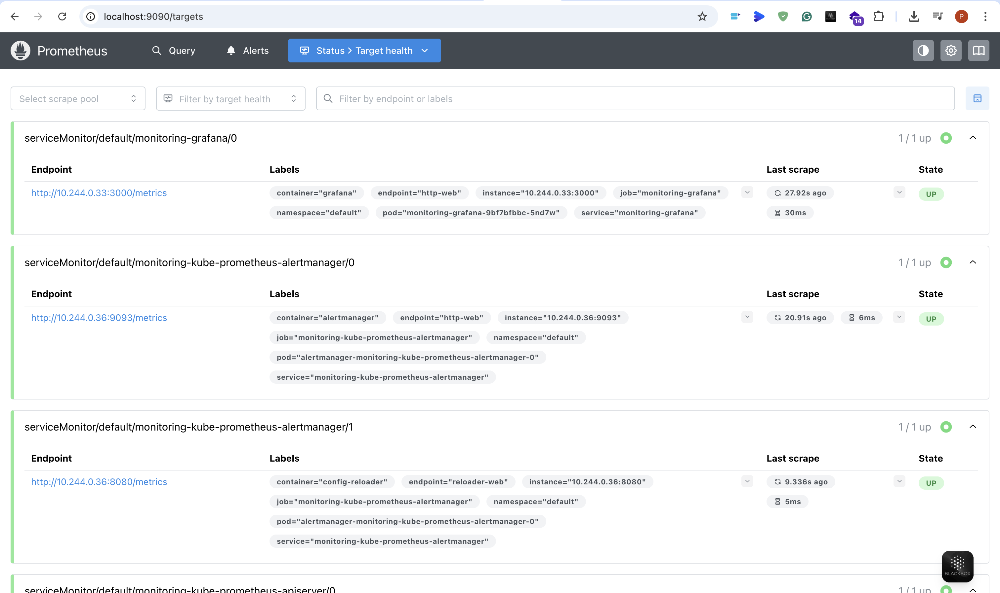

### Grafana Dashboard

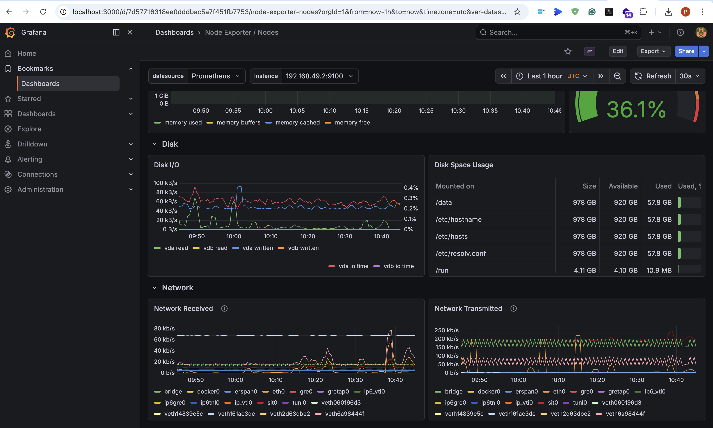
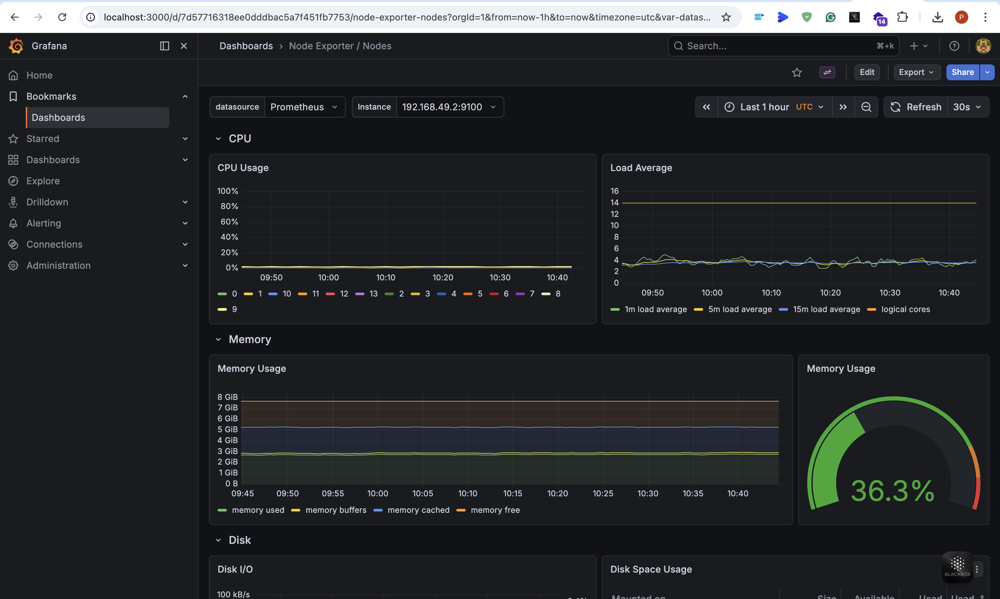


### Alert Triggered (Firing)
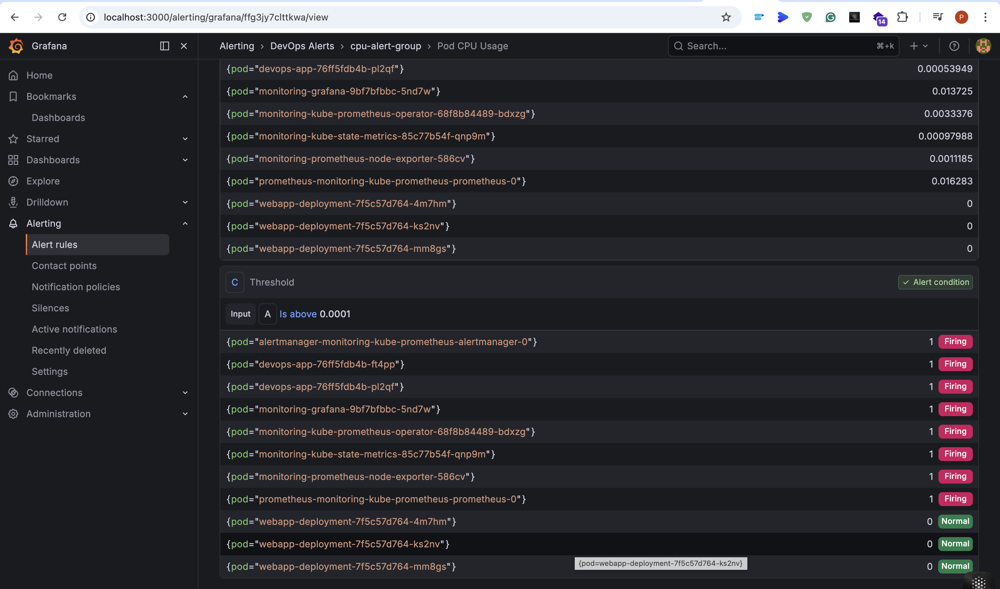
---

## 📊 Grafana Dashboard Import

To import this dashboard into any Grafana instance:

1. Go to **Grafana → Dashboards → Import**
2. Upload `grafana-dashboards/devops-app-monitoring.json`
3. Select your Prometheus data source
4. Click **Import**

---

## 🔁 Monitoring Flow

```
Application Pods
      │
      ▼
Prometheus scrapes /metrics endpoint
      │
      ▼
Grafana queries Prometheus via PromQL
      │
      ▼
Real-time dashboards visualize metrics
      │
      ▼
Alert rules evaluate thresholds
      │
      ▼
Alert fires → Contact Point (webhook) notified
```

---

## 🎯 Skills Demonstrated

- Docker image building, build context management, and local testing
- Kubernetes deployments, services, and pod lifecycle management
- Loading local Docker images into Minikube (`minikube image load`)
- GitHub Actions CI/CD pipeline setup and Dockerfile path debugging
- Helm-based deployment of production monitoring stacks
- PromQL query writing for custom Grafana panels
- Grafana alert rule configuration, threshold tuning, and contact point setup
- Diagnosing and resolving real Kubernetes and DevOps errors end-to-end
- Dashboard export, file management, and GitHub integration

---

## 💡 Interview Tip

If asked **"What challenges did you face?"** — mention these three:

1. **Docker build context issue** — `COPY` path outside build context, fixed by restructuring the Dockerfile location
2. **Kubernetes ImagePullBackOff** — local image not available to cluster, fixed using `minikube image load`
3. **Grafana alert threshold tuning** — Prometheus CPU values are tiny decimals, had to lower threshold from `0.05` to `0.0001`

These show **real hands-on troubleshooting experience**, not just theory.

---

## 👤 Author

**Pooja Das**
DevOps Engineer | [GitHub](https://github.com/ThePoojaDas)

---

> ⭐ If you found this project helpful, please consider starring the repository!
